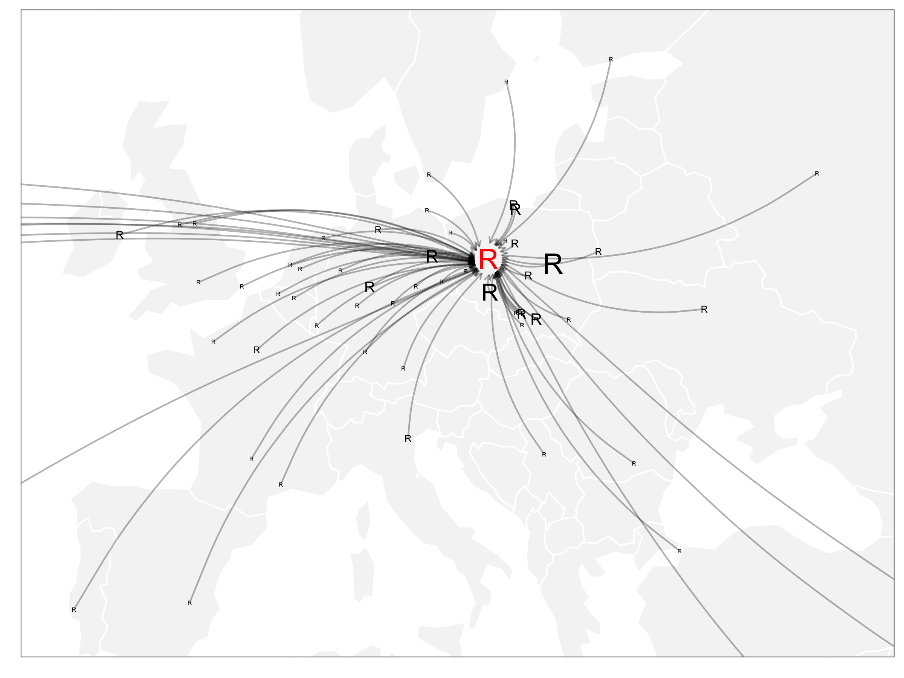

---
output:
  md_document:
    variant: markdown_github
---

# Maps of the participants of the European R users meeting 2016

<!-- README.md is generated from README.Rmd. Please edit that file -->

```{r, echo = FALSE}
knitr::opts_chunk$set(
  collapse = TRUE,
  comment = "#>",
  fig.path = "figure/",
  fig.height = 6, 
  echo = FALSE,
  warning = FALSE, 
  message = FALSE
)
```




<iframe src="https://rawgit.com/pbiecek/Maps/master/maps/maps002.html"></iframe>


<iframe src="https://rawgit.com/pbiecek/Maps/master/maps/maps004.html"></iframe>


