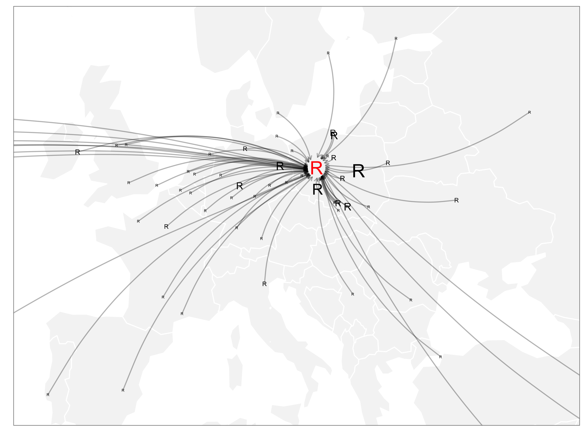

Maps of the participants of the European R users meeting 2016
=============================================================

<!-- README.md is generated from README.Rmd. Please edit that file -->

<iframe src="https://rawgit.com/pbiecek/Maps/master/maps/maps002.html">
</iframe>

<iframe src="https://rawgit.com/pbiecek/Maps/master/maps/maps004.html">
</iframe>
